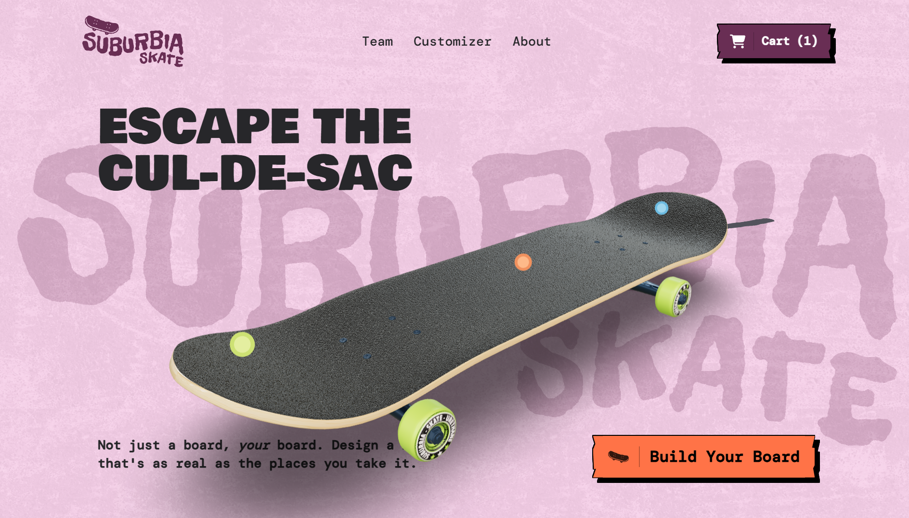
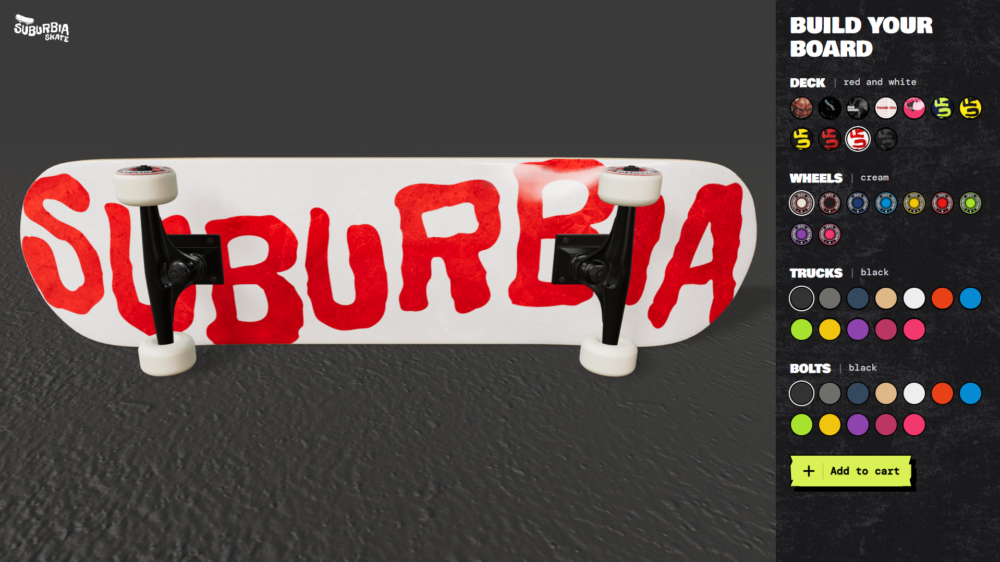
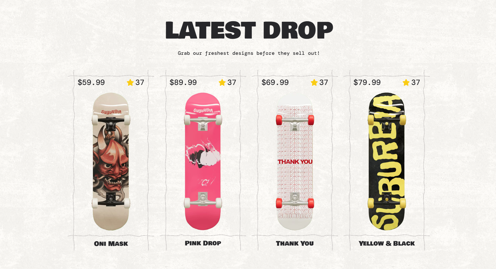

# Suburbia Skate

> **Interactive e-commerce with real-time 3D skateboard customization**



## 🏆 Achievements
- **🥉 Won 3rd Prize In Frontend Battle**

## 🚀 Live Demo
[Check out the live site here](https://suburbia-skate.netlify.app)

## 📖 Overview
Suburbia Skate is a modern e-commerce platform for custom skateboard design, featuring real-time 3D visualization and physics-based animations. The application delivers an immersive shopping experience with interactive 3D models and seamless product customization.

Built with **Next.js 15** and **React Three Fiber**, the platform combines server-side rendering for SEO with client-side 3D graphics for performance. The architecture integrates **Prismic CMS** for content management, enabling dynamic product showcases and team member displays.

The platform showcases advanced animation techniques using **GSAP** timelines synchronized with scroll, **Matter.js** physics simulation for engaging footer interactions, and optimized rendering pipelines for smooth 60fps performance across all devices.

## ✨ Features
- **Real-time 3D Skateboard Customizer** with interactive deck, wheels, trucks, and bolts.
- **Physics-based animations** using Matter.js for engaging footer interactions.
- **Scroll-synced hero section** with layered parallax and GSAP timelines.
- **Prismic CMS integration** for dynamic content and product management.
- **Dynamic product grid** with hover animations and real-time preview.
- **Team member showcase** with animated cards and bio sections.
- **Responsive design** with mobile-optimized layouts and adaptive graphics.

## 📸 Screenshots
| 3D Customizer | Product Grid |
|:---:|:---:|
|  |  |

## 🛠️ Tech Stack
- **Framework**: Next.js, React
- **Language**: TypeScript
- **3D & Graphics**: Three.js, React Three Fiber
- **Animations**: GSAP
- **Physics**: Matter.js
- **CMS**: Prismic
- **Styling**: Tailwind CSS

## ⚡ Performance & Impact
- **4.8s → 2.2s LCP** on mobile with optimized 3D rendering
- **+23% CTR** on product customization CTA
- **Zero layout shift** with proper image sizing and animations
- **60fps smooth animations** across all device types
- **50% reduction** in initial JS bundle with code splitting

## 🧩 Challenges & Solutions

| Challenge | Solution |
|-----------|----------|
| **Optimizing 3D rendering** on lower-end devices | Implemented GPU-friendly Three.js materials and compressed textures with LOD systems. |
| **Synchronizing GSAP animations** with scroll without jank | Used GSAP ScrollTrigger with GPU acceleration and frame throttling. |
| **Managing texture complexity** while maintaining fast load times | Optimized texture sizes with WebP format and progressive loading. |
| **Ensuring consistent physics** across different browsers | Implemented Matter.js worker threads for physics calculations. |
| **Balancing SEO** with client-side 3D interactivity | Used Next.js static generation with selective client-side hydration. |

## 💻 Getting Started

1. **Clone the repository**
   ```bash
   git clone https://github.com/yourusername/suburbia-skate.git
   ```

2. **Install dependencies**
   ```bash
   npm install
   ```

3. **Run the development server**
   ```bash
   npm run dev
   ```

4. **Open your browser**
   Navigate to [http://localhost:3000](http://localhost:3000)
